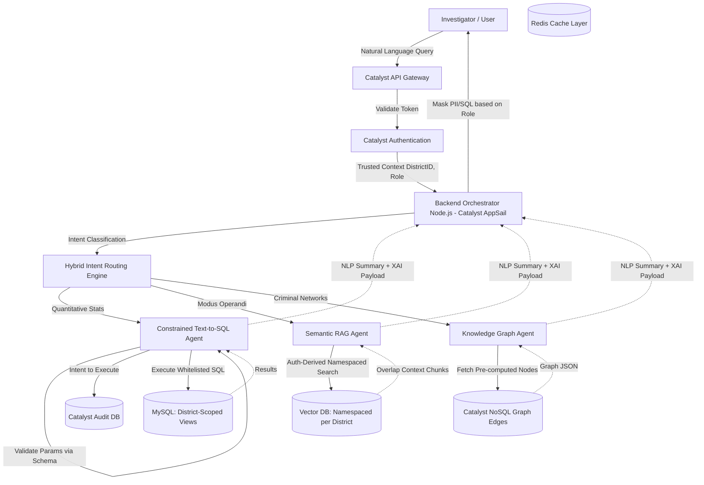
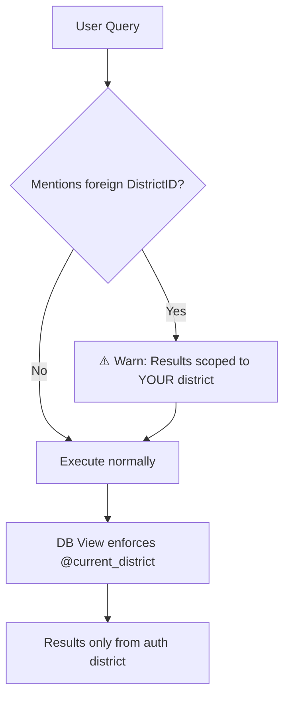
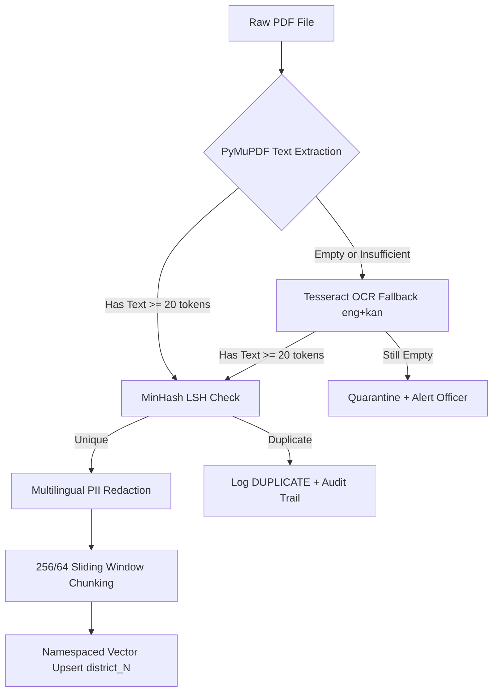
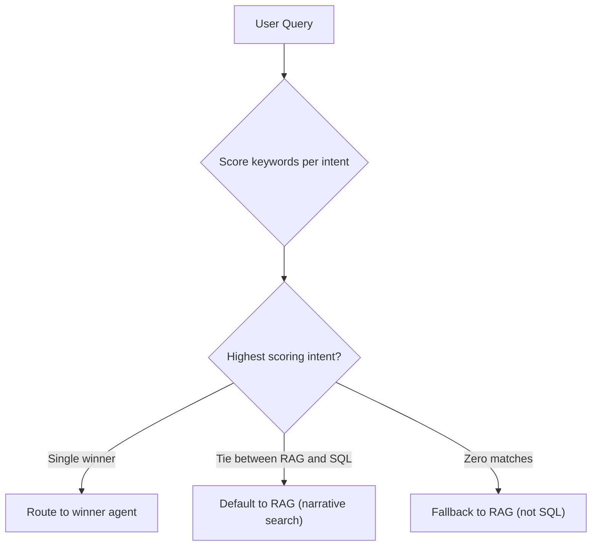

# KSP Crime Database AI Platform: Production-Ready Architecture Blueprint

This document defines the military-grade, zero-trust architectural blueprint for the Karnataka State Police (KSP) Intelligent Conversational AI. Designed to operate safely on a highly normalized 25+ table MySQL database, this platform strictly isolates data access, eliminates LLM hallucinations in structured queries, and guarantees forensic auditability.

---

## 1. System Architecture Overview & Data Flow

The backend orchestrator utilizes an API-first microservices approach hosted on **Zoho Catalyst**, strictly enforcing read-only database connections, view-level security, and persistent audit trails.

### End-to-End Data Flow

---

## 2. Hybrid Intent Routing Engine (Latency < 5ms)

Semantic-only routing introduces unacceptable vector-embedding latency. We utilize a **Hybrid Intent Router**:
1. **Rule-Based Routing:** Keyword and regex matching immediately classify 80% of standard police queries (e.g., "arrests", "how many"). Latency is under 5ms.
2. **ML Fallback:** Only deeply ambiguous queries fall back to a lightweight DistilBERT classification model. 

---

## 3. The 3 Intelligence Agents

### A. The Constrained Text-to-SQL Agent (Zero SQL Hallucination)
We explicitly reject "Schema RAG" and LLM SQL generation due to the catastrophic risk of semantic hallucination and SQL injection. 
*   **Parameterized Whitelists:** The LLM's only job is to extract search parameters (e.g., Date Ranges) which are strictly validated against a domain schema. It executes pre-compiled, DBA-approved queries.
*   **Database View-Level RLS:** Security is not enforced by prompt injection. Queries execute against **District-Scoped Views** ensuring cross-district data leakage is mathematically impossible. 
*   **0-TTL Caching:** Live, active case data bypasses the cache entirely. Only historical, static queries are cached.

### B. The Semantic RAG Agent (Unstructured FIRs)
*   **Multilingual PII Redaction:** Before embedding, regional scripts (Kannada, Hindi) are parsed by `ai4bharat/indic-ner` to redact victim names in compliance with POCSO guidelines.
*   **MinHash LSH Deduplication:** Avoids the brittleness of SHA-256. Backed by Redis, it handles OCR variance and amended FIRs gracefully with strict document-level invalidation.
*   **Sliding Window Chunking:** FIRs are chunked at 256 tokens with a 64-token overlap, retaining parent document context for accurate retrieval.
*   **Namespaced Vector RLS:** Vector searches are strictly partitioned into isolated district collections derived directly from the user's auth token.

### C. The Knowledge Graph Agent
*   Maps Accused-Victim-Case relationships using pre-computed graph edges stored in Catalyst NoSQL, yielding network insights in milliseconds without recursive SQL latency.

---

## 4. Explainable AI (XAI) & Forensic Auditability

*   **Standardized XAI Payload:** All responses return a structured JSON payload detailing the NLP answer, reasoning path, and source citations.
*   **Tiered Role-Based Masking:** Constables see no execution details. Inspectors see the RLS enforcement type and scoped district. Only Superintendents see raw SQL and parameter values.
*   **Cross-District Mention Detection:** If a user's query explicitly references a foreign district (e.g., "District 15"), the system appends a visible warning to the response confirming that results are scoped to their authorized jurisdiction only.
*   **Append-Only Forensic Auditing:** A dedicated database connection pool (`audit_writer`) logs every query intent and outcome, hashing PII parameters while leaving query types in plaintext for legal reconstructability.

---

## 5. Chaos Engineering Safeguards

### A. Cross-District Query Defense

### B. Ingestion Pipeline — Corruption Resilience

*   **Minimum Token Gate (20 tokens):** Documents with fewer than 20 tokens after extraction are quarantined and never touch the MinHash LSH index, preventing empty-signature poisoning.
*   **OCR Fallback:** Scanned handwritten PDFs are routed through Tesseract with `eng+kan` (English + Kannada) language packs before quarantine.
*   **Batch Error Isolation:** A `ThreadPoolExecutor` processes PDFs in parallel. Each document is wrapped in its own `try/except`, ensuring a single corrupt file cannot crash the pipeline for the remaining documents.
*   **Ingestion Report:** Every batch returns a structured status report (`SUCCESS` / `DUPLICATE` / `QUARANTINED` / `FAILED`) with per-document detail strings.

### C. Score-Based Intent Routing

*   **Rationale:** An ambiguous police query (e.g., "Find the guy with the red bike") is overwhelmingly more likely to be a narrative case search (RAG) than a statistical aggregation (SQL). Misrouting to SQL produces a dead-end refusal. Misrouting to RAG produces a best-effort semantic search that may still surface useful case files.
