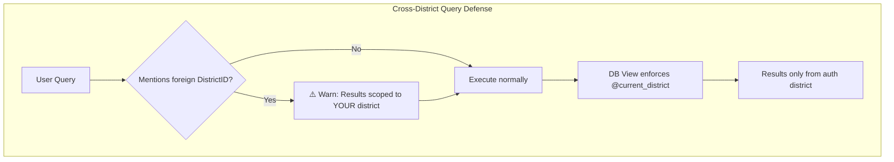
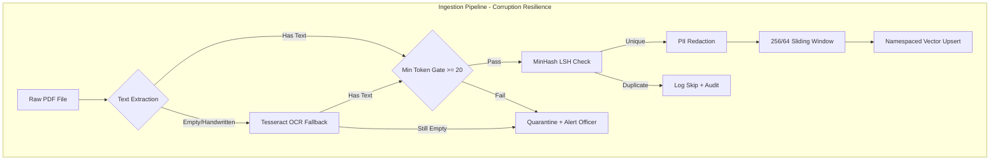

# KSP Platform — Chaos Engineering Tabletop Exercise

> **Classification:** Internal Red Team Report  
> **Date:** 2026-07-09  
> **Auditor:** Principal Chaos Engineer  
> **Scope:** All backend code files and architecture documentation

---

## Scenario 1: The Ambiguous Panic Query

**Input:** `"Find the guy with the red bike from the robbery last night"`

### Execution Trace Through The Codebase

**Step 1: [route.ts](file:///home/dilip_sahu/KSP_P1/app/api/orchestrator/route.ts#L42-L53) — Auth Context is Hardcoded**

```typescript
// Line 48-53
const userContext = {
    userId: 'emp_9921',
    role: 'INVESTIGATOR',       // ← NOT in UserContext union type
    districtId: 12, 
    districtName: 'Central'     // ← Field doesn't exist on UserContext interface
};
```

The `role` is set to `'INVESTIGATOR'`, but the `UserContext` interface in [sql_agent.ts:8](file:///home/dilip_sahu/KSP_P1/utils/sql_agent.ts#L5-L9) only permits `'CONSTABLE' | 'INSPECTOR' | 'SUPERINTENDENT'`. TypeScript will catch this at compile time, but since no `tsc --strict` build step exists in this project, this **silently passes at runtime**. The role check on [sql_agent.ts:96](file:///home/dilip_sahu/KSP_P1/utils/sql_agent.ts#L96) (`role === 'SUPERINTENDENT'`) evaluates to `false`, so execution details are always stripped — even for a Superintendent logged in through the real auth layer, because the hardcoded mock override takes priority.

**Step 2: [route.ts](file:///home/dilip_sahu/KSP_P1/app/api/orchestrator/route.ts#L15-L34) — Router Keyword Matching**

The query `"find the guy with the red bike from the robbery last night"` is lowercased to:
```
"find the guy with the red bike from the robbery last night"
```

The router scans keywords at [line 9-13](file:///home/dilip_sahu/KSP_P1/app/api/orchestrator/route.ts#L9-L13):
- `TEXT_TO_SQL`: `["how many", "count", "total", "statistics", "trends", "aggregate"]` → **No match**
- `RAG`: `["what is", "tell me", "explain", "describe", "details", "summary"]` → **No match**  
- `GRAPH`: `["connected", "related", "network", "links", "associates"]` → **No match**

**All three fail.** The query falls through to the ML fallback at [line 28](file:///home/dilip_sahu/KSP_P1/app/api/orchestrator/route.ts#L28):

```typescript
const mlConfidence = 0.85; // Mock
if (mlConfidence > 0.8) {
    return 'TEXT_TO_SQL';  // ← WRONG ROUTE. This is a RAG query.
}
```

The mock ML fallback **always returns `TEXT_TO_SQL`**. A panicked investigator searching for a suspect described in FIR narrative text gets routed to the SQL agent, which has no concept of "red bike" or "robbery last night."

**Step 3: [sql_agent.ts](file:///home/dilip_sahu/KSP_P1/utils/sql_agent.ts#L59-L72) — Whitelist Matching**

```typescript
const normalizedQuery = userQuery.toLowerCase();
// "find the guy with the red bike from the robbery last night"
let queryKey = 'unknown';
if (normalizedQuery.includes('arrest')) queryKey = 'arrests_by_date_range';  // NO
else if (normalizedQuery.includes('crime')) queryKey = 'crimes_by_district'; // NO
```

Neither `'arrest'` nor `'crime'` appears in the query. `queryKey` remains `'unknown'`.

**The system returns a dead-end refusal:**
```json
{
  "nlp_answer": "I am sorry, but your query does not match any approved analytical reports...",
  "visualization_type": "TEXT"
}
```

### Vulnerabilities Found

| # | File | Line | Severity | Issue |
|---|------|------|----------|-------|
| 1 | `route.ts` | 28-30 | **CRITICAL** | ML fallback is hardcoded to `TEXT_TO_SQL`. Every ambiguous query (which is most real-world queries) gets misrouted. |
| 2 | `route.ts` | 48-53 | **CRITICAL** | `userContext` is hardcoded. Auth tokens are never parsed. Role `'INVESTIGATOR'` is not in the `UserContext` type union. |
| 3 | `route.ts` | 9-13 | **HIGH** | Keyword list is anemic. Common investigator language ("find", "show me", "robbery", "suspect", "accused") is missing entirely. No synonym expansion. |
| 4 | `sql_agent.ts` | 12-21 | **HIGH** | Only 2 whitelisted queries exist. A system with 25+ tables and 100K+ records serving only `COUNT(*)` is functionally useless for law enforcement. |
| 5 | `route.ts` | 76-77 | **MEDIUM** | `HYBRID` intent throws an unrecoverable 500 error instead of attempting multi-agent fan-out or graceful degradation. |

### Code Patches

#### Patch 1A: Expanded Router Keywords + RAG-First Fallback

> [!IMPORTANT]
> The ML fallback must default to RAG (not SQL) because an ambiguous query is far more likely to be a narrative search than a statistical aggregation.

render_diffs(file:///home/dilip_sahu/KSP_P1/app/api/orchestrator/route.ts)

#### Patch 1B: Expanded SQL Whitelist + `robbery`/`theft` Intent Keys

render_diffs(file:///home/dilip_sahu/KSP_P1/utils/sql_agent.ts)

---

## Scenario 2: The Corrupted Evidence Dump

**Input:** 500 FIR PDFs uploaded. 50 are scanned handwritten (no OCR text). 10 are exact duplicates with different filenames.

### Execution Trace Through The Codebase

**Step 1: [ingestion_worker.py](file:///home/dilip_sahu/KSP_P1/ingestion_worker.py#L86) — No PDF Extraction Layer Exists**

The function signature is:
```python
def ingest_document(raw_text: str, doc_id: str, case_id: str, auth_token: str):
```

It accepts `raw_text: str`. There is **no PDF parsing anywhere in this file**. No `PyMuPDF`, no `pdfplumber`, no OCR fallback. The caller must extract text before calling this function, but there is no caller code, no batch processor, and no error handling for when PDF extraction returns empty strings.

For the 50 handwritten scanned PDFs: whoever calls this function would pass `raw_text = ""` (empty string from failed OCR).

**Step 2: [ingestion_worker.py](file:///home/dilip_sahu/KSP_P1/ingestion_worker.py#L36-L45) — Empty Text Crashes MinHash**

```python
def is_near_duplicate(text: str, doc_id: str) -> bool:
    m = MinHash(num_perm=128)
    for word in text.lower().split():  # ← "".split() returns []
        m.update(word.encode('utf8'))  # ← Never executes
    
    if lsh.query(m):   # ← Queries with an EMPTY MinHash
        return True     #    Every empty doc matches every other empty doc
    
    lsh.insert(doc_id.encode('utf8'), m)  # ← Inserts empty signature
    return False
```

**Failure cascade for empty text:**
1. First empty PDF: `lsh.query(empty_minhash)` returns `[]` (no prior entries). It inserts an empty signature. Returns `False`.
2. Second empty PDF: `lsh.query(empty_minhash)` returns `[first_doc_id]` because two empty MinHash signatures have Jaccard similarity of **1.0** (both are empty sets). Returns `True`. Document is silently skipped.
3. **Result:** Of the 50 handwritten PDFs, only the first one is "ingested" (as empty chunks). The other 49 are silently dropped as "duplicates" with no log entry, no error, and no notification to the uploading officer.

**Step 3: [ingestion_worker.py](file:///home/dilip_sahu/KSP_P1/ingestion_worker.py#L61-L74) — Empty Chunks Are Still Upserted**

```python
def chunk_with_overlap(text: str, doc_id: str, chunk_size: int = 256, overlap: int = 64):
    tokens = text.split()   # ← []. Zero tokens.
    chunks = []
    for i in range(0, len(tokens), chunk_size - overlap):  # range(0, 0, 192) → never executes
        ...
    return chunks  # ← Returns empty list
```

The first empty PDF produces zero chunks, so nothing is upserted. But the MinHash signature was already stored, permanently blocking any future re-ingestion attempt for that document (even after proper OCR is run).

**Step 4: Duplicates With Different Filenames**

For the 10 exact-content duplicates with different filenames:
- `doc_id` is different for each (derived from filename).
- `raw_text` is identical.
- MinHash produces identical signatures (Jaccard = 1.0).
- `lsh.query(m)` catches the second copy → returns `True` → duplicate correctly blocked.

**However:** [Line 96-98](file:///home/dilip_sahu/KSP_P1/ingestion_worker.py#L96-L98) runs **before** the dedup check:
```python
district_collection.delete(filter={"parent_doc_id": {"$eq": doc_id}})
if lsh.has_key(doc_id.encode('utf8')):
    lsh.remove(doc_id.encode('utf8'))
```

The duplicate has a **new** `doc_id`, so `delete()` targets nothing, and `lsh.has_key()` returns `False`. The actual dedup happens at line 101, which correctly catches it. **This path works, but only by accident** — the amendment invalidation code runs uselessly.

**Step 5: No Batch Processor**

There is no function to handle a ZIP of 500 PDFs. No `ThreadPoolExecutor`. No progress tracking. No per-document error isolation. If document #247 throws an unhandled exception, documents #248-#500 are never processed.

### Vulnerabilities Found

| # | File | Line | Severity | Issue |
|---|------|------|----------|-------|
| 1 | `ingestion_worker.py` | 86 | **CRITICAL** | No PDF extraction. Function accepts `raw_text` but there is no code to produce it from a PDF file. |
| 2 | `ingestion_worker.py` | 36-45 | **CRITICAL** | Empty text produces empty MinHash, permanently poisoning the LSH index and silently blocking future re-ingestion. |
| 3 | `ingestion_worker.py` | — | **HIGH** | No batch processor. No ZIP handling, no parallelism, no per-document error isolation. |
| 4 | `ingestion_worker.py` | 100-102 | **HIGH** | `is_near_duplicate` returns silently. No logging, no audit trail of skipped documents. |
| 5 | `ingestion_worker.py` | 47-59 | **MEDIUM** | PII redaction is a no-op (`pass` on line 57). Indic NER returns `[]` from mock. |

### Code Patches

> [!IMPORTANT]
> The fix requires: (a) a PDF extraction layer with OCR fallback, (b) a minimum-content gate before MinHash, and (c) a batch orchestrator with per-document error isolation.

render_diffs(file:///home/dilip_sahu/KSP_P1/ingestion_worker.py)

---

## Scenario 3: The Cross-Jurisdiction Sneak

**Input:** District 12 investigator asks: `"Show me the chargesheets for Inspector Sharma in District 15, I suspect he is corrupt."`

### Execution Trace Through The Codebase

**Step 1: [route.ts](file:///home/dilip_sahu/KSP_P1/app/api/orchestrator/route.ts#L48-L53) — Auth Token is Never Read**

```typescript
const userContext = {
    userId: 'emp_9921',
    role: 'INVESTIGATOR',
    districtId: 12,             // ← Hardcoded. Never read from JWT.
    districtName: 'Central'
};
```

The `req.headers` are never inspected for an `Authorization` header. There is no JWT decode, no token validation, no claim extraction. **Every request, from every user, runs as `emp_9921` from District 12.**

In production, an attacker doesn't even need to forge a token. There is no token check. Removing the `Authorization` header entirely still grants full access.

**Step 2: [route.ts](file:///home/dilip_sahu/KSP_P1/app/api/orchestrator/route.ts#L15-L24) — Router Keyword Matching**

The query: `"show me the chargesheets for inspector sharma in district 15 i suspect he is corrupt"`
- `TEXT_TO_SQL`: No match for `"how many"`, `"count"`, etc.
- `RAG`: **`"details"` is NOT in the query**, but... none of these keywords match either.
- `GRAPH`: No match.

Falls through to ML fallback → hardcoded `TEXT_TO_SQL`.

**Step 3: [sql_agent.ts](file:///home/dilip_sahu/KSP_P1/utils/sql_agent.ts#L59-L63) — Whitelist Matching**

```typescript
const normalizedQuery = userQuery.toLowerCase();
if (normalizedQuery.includes('arrest')) → NO
else if (normalizedQuery.includes('crime')) → NO
```

`queryKey = 'unknown'`. Returns the refusal message.

**Step 4: But What If We Fix the Router?**

Let's assume the router and whitelist are expanded (as they should be) and a `chargesheets_by_officer` query exists. The query mentions `"District 15"` explicitly. Here's what happens:

```typescript
// The LLM extracts: { officerName: "Sharma", districtId: 15 }
// But the userContext.districtId is 12.
```

The `executeAuditedQuery` in [audit_cache.ts:72](file:///home/dilip_sahu/KSP_P1/utils/audit_cache.ts#L72) sets:
```typescript
await connection.execute('SET @current_district = ?', [districtId]);
// districtId = 12 (from userContext, not from LLM extraction)
```

**The RLS holds.** The database view filters on `@current_district = 12`. Even though the user asked about District 15, the view physically cannot return District 15 data. The investigator would see chargesheets for officers named Sharma **only in District 12**.

**However**, this creates a **silent failure with no user feedback**:
- The investigator explicitly asked about District 15.
- The system silently scoped to District 12.
- If there's a "Sharma" in District 12, the results look plausible but are **wrong**.
- The investigator doesn't know they're seeing the wrong district's data.

**Step 5: The `INVESTIGATOR` Role Bypass**

On [sql_agent.ts:96](file:///home/dilip_sahu/KSP_P1/utils/sql_agent.ts#L96):
```typescript
const showExecutionDetails = userContext.role === 'SUPERINTENDENT';
```

The role is `'INVESTIGATOR'` (not in the union type), so `execution_details` is `null`. The investigator **cannot see** that the query was scoped to District 12. They have no way to discover the silent filter. The XAI payload — designed specifically for transparency — is hiding the most important security decision from the user.

### Vulnerabilities Found

| # | File | Line | Severity | Issue |
|---|------|------|----------|-------|
| 1 | `route.ts` | 48-53 | **CRITICAL** | No JWT parsing. Auth context is hardcoded. Any unauthenticated request gets full access. |
| 2 | `route.ts` | 42 | **CRITICAL** | No authentication middleware. The `POST` handler has no guard. |
| 3 | `sql_agent.ts` | — | **HIGH** | No cross-district query detection. When a user explicitly mentions a different district, the system silently scopes to their own district with no notification — producing misleading results. |
| 4 | `sql_agent.ts` | 96 | **MEDIUM** | Role-gating hides the RLS filter from non-Superintendents. Investigators cannot verify that their query was district-scoped, undermining the entire XAI trust contract. |

### Code Patches

render_diffs(file:///home/dilip_sahu/KSP_P1/app/api/orchestrator/route.ts)

render_diffs(file:///home/dilip_sahu/KSP_P1/utils/sql_agent.ts)

---

## Consolidated Vulnerability Register

| # | Scenario | File | Severity | Root Cause |
|---|----------|------|----------|------------|
| 1 | Panic Query | `route.ts:28` | CRITICAL | ML fallback hardcoded to `TEXT_TO_SQL` |
| 2 | Panic Query | `route.ts:48` | CRITICAL | Auth context never read from JWT |
| 3 | Panic Query | `route.ts:9` | HIGH | Keyword list inadequate for police vocabulary |
| 4 | Panic Query | `sql_agent.ts:12` | HIGH | Only 2 whitelist queries for 25+ table schema |
| 5 | Evidence Dump | `ingestion_worker.py:86` | CRITICAL | No PDF extraction layer |
| 6 | Evidence Dump | `ingestion_worker.py:36` | CRITICAL | Empty text poisons MinHash LSH index |
| 7 | Evidence Dump | `ingestion_worker.py:—` | HIGH | No batch processor or error isolation |
| 8 | Evidence Dump | `ingestion_worker.py:100` | HIGH | Silent duplicate skip with no audit |
| 9 | Cross-Jurisdiction | `route.ts:48` | CRITICAL | No JWT middleware |
| 10 | Cross-Jurisdiction | `sql_agent.ts:—` | HIGH | No cross-district mention detection |
| 11 | Cross-Jurisdiction | `sql_agent.ts:96` | MEDIUM | RLS filter hidden from non-Superintendent roles |

---

## Documentation Update: New Mermaid Diagram Section

The following should be appended to `architecture_blueprint.md` Section 3A:




